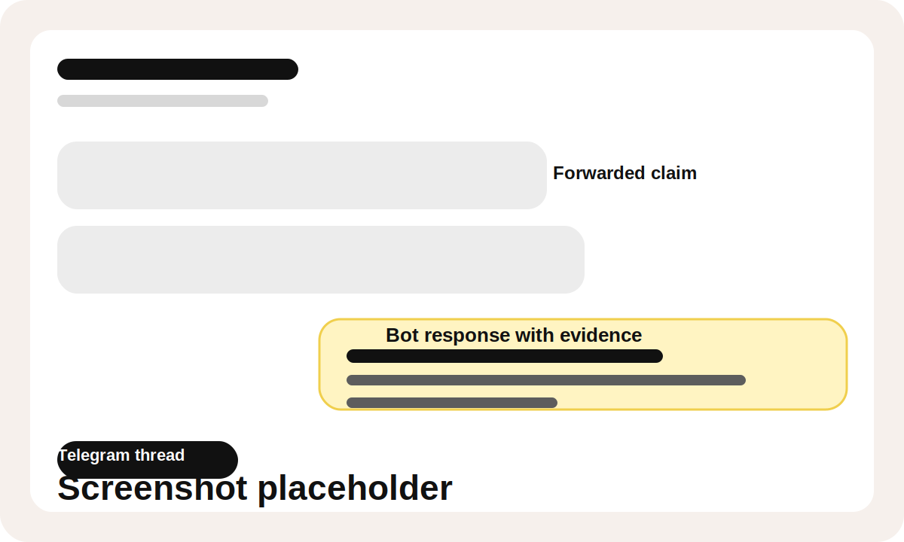
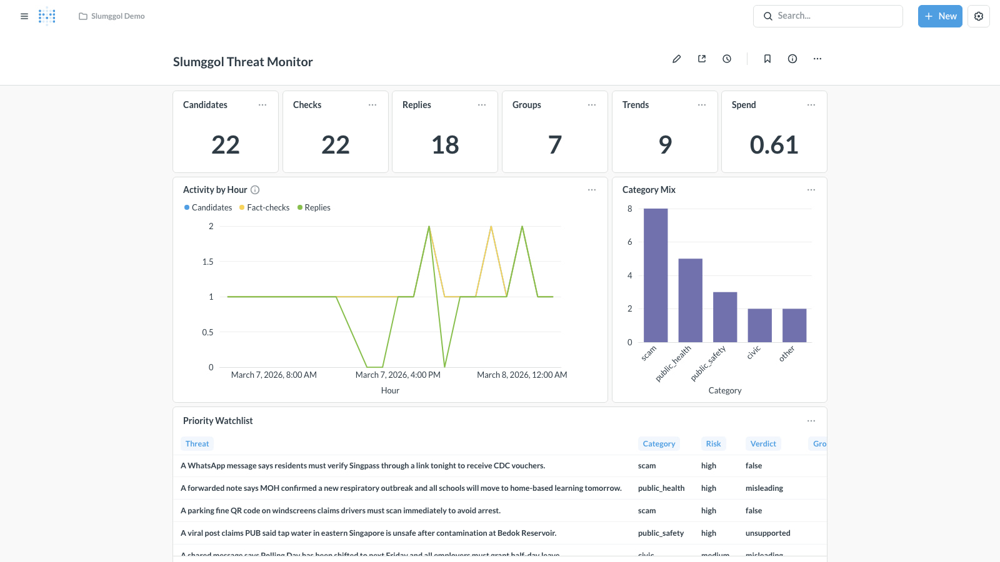
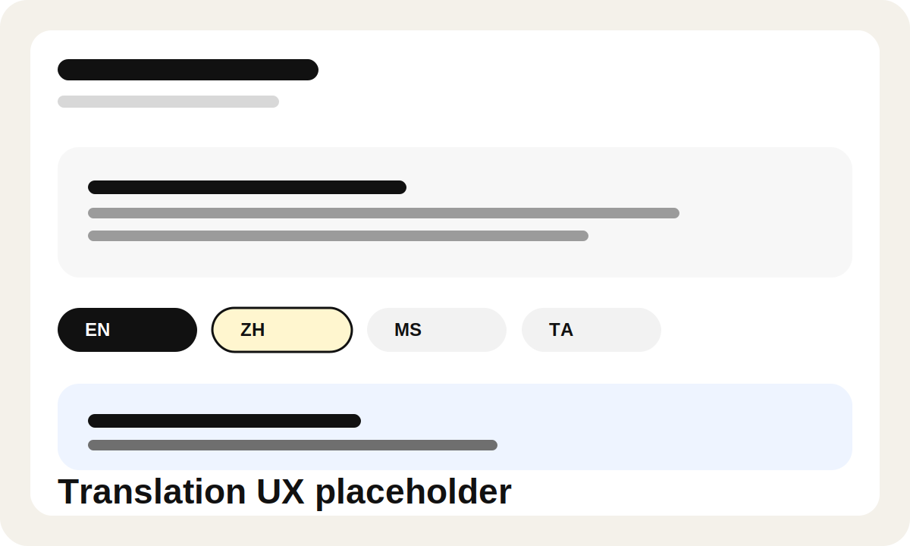
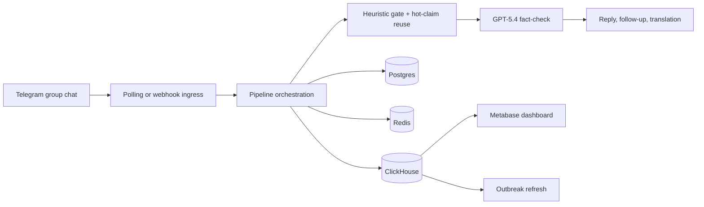

# IsRealANot


> Quiet, evidence-first fact-checking for noisy Telegram group chats.

Slumggol Bot is a Hackomania project built for Singapore group chats, where rumours, scam forwards, policy confusion, and low-context screenshots can spread faster than people can verify them. The bot stays mostly dormant, checks only the messages that look worth checking, and replies only when the evidence is strong enough.

This is not a "fact-check everything" bot. It is a selective, safety-minded system that combines GPT-5.4, Telegram-native UX, and ClickHouse analytics to reduce real-world harm without flooding chats with bot spam.

## Why this matters

Group chats are where misinformation becomes social proof. A single forwarded message in the right family, school, workplace, or neighborhood chat can trigger panic, amplify scams, or spread harmful advice long before anyone opens a browser tab.

Slumggol is designed to meet people where that happens:

- clearly assess whether a claim looks credible, uncertain, or misleading
- surface useful context and cited evidence, not just a label
- work across mixed-language Southeast Asian chat patterns
- reduce harm without over-censoring normal conversation

## What the bot actually does

- Monitors Telegram group chats through polling or webhook delivery.
- Uses heuristic gating and hot-claim reuse so it does not spend model calls on every message.
- Runs GPT-5.4 fact-checks only on likely candidates.
- Auto-replies only for harmful misinformation that clears stricter thresholds.
- Queues uncertain but important cases for escalation instead of bluffing.
- Supports manual `/factcheck` checks, reply-in-thread follow-up questions, and one-tap translations.
- Handles text, images, and voice notes on the normal path.
- Adapts reply tone per group while keeping evidence and verdicting centralized.

## Demo flow

1. A claim appears in a Telegram group chat.
2. The gate decides whether it looks risky, viral, or worth analysis.
3. The bot checks caches and hot-claim intelligence before making a new model call.
4. GPT-5.4 produces a verdict, confidence score, and evidence set.
5. The bot replies only when the result is strong enough to justify interrupting the chat.
6. ClickHouse updates analytics so operators can see spread, reuse, and outbreak patterns across groups.

## Screenshots

<!-- Replace the remaining placeholders with real screenshots before final submission. -->

| Telegram fact-check thread | Analytics dashboard | Translation UX |
| --- | --- | --- |
|  |  |  |

## Why ClickHouse is central

ClickHouse is not here as a side database or a fancy log bucket. It is the analytics engine that makes the product operationally useful.

Postgres is the source of truth for bot state. Redis handles transient coordination. ClickHouse handles the high-volume, append-only event stream and the rollups that answer the questions a real response team cares about in near real time.

| Product question | Why it matters | Powered by |
| --- | --- | --- |
| Which claims are spiking right now? | Helps spot fast-moving misinformation before it spreads further. | `dashboard_trending_claims_24h` |
| Which groups are seeing the same claim? | Shows cross-group spread instead of isolated chat noise. | `dashboard_claim_group_spread_24h` |
| Which risky scams need immediate attention? | Surfaces the highest-harm content for response priority. | `dashboard_high_risk_scams_24h` |
| What is the operational picture over the last 24h? | Tracks volume, reply coverage, and model spend. | `dashboard_summary_24h` |

ClickHouse also powers outbreak refresh jobs and hot-claim intelligence. That means it directly improves how the bot prioritizes repeated claims, not just how the team views historical data later.

## Trust and safety guardrails

- Raw inbound text, image bytes, audio bytes, and transcripts are processed in memory and are not persisted.
- Auto-replies currently require `needs_reply=True`, a verdict in `false`, `misleading`, or `unsupported`, confidence of at least `0.82`, and at least `2` evidence sources.
- Public health and public safety claims require at least one Singapore-first or official source before an automatic reply is allowed.
- Unclear but potentially important cases are escalated instead of auto-posted.
- Analytics failures fail open. If ClickHouse is unavailable, the bot still runs.

## Architecture



- `Postgres`: source of truth for group state, cached verdicts, style profiles, and escalation records.
- `Redis`: transient coordination for queues, rate limits, hot-claim prewarming, and hash observations.
- `ClickHouse`: analytics-only store for rollups, dashboards, and cross-group outbreak discovery.

## Run it locally

1. Copy `.env.example` to `.env` and set `OPENAI_API_KEY`, `TELEGRAM_BOT_TOKEN`, `TELEGRAM_BOT_USERNAME`, and `ADMIN_API_TOKEN`.
2. Start Postgres and Redis:

   ```bash
   docker compose up -d postgres redis
   ```

3. Install dependencies and run migrations:

   ```bash
   uv sync
   uv run alembic upgrade head
   ```

4. Start the bot in the default local polling mode:

   ```bash
   docker compose --profile polling up --build
   ```

5. Create a Telegram bot with BotFather, disable privacy for group usage with `/setprivacy`, and add the bot to a test group.

Useful development commands:

```bash
uv run pytest
uv run ruff check .
uv run mypy src
```

<details>
<summary>Optional: enable ClickHouse + dashboard</summary>

Set these values in `.env`:

```dotenv
ENABLE_CLICKHOUSE=true
CLICKHOUSE_URL=https://your-clickhouse-host:8443
CLICKHOUSE_DATABASE=bot_analytics
CLICKHOUSE_USER=slumggol_ingest
CLICKHOUSE_PASSWORD=replace-with-password
OUTBREAK_REFRESH_INTERVAL_MINUTES=5
```

Then run:

```bash
uv run python scripts/manage_clickhouse.py ping
uv run python scripts/manage_clickhouse.py bootstrap
uv run python scripts/manage_clickhouse.py smoke
docker compose --profile polling --profile dashboard up --build
```

The canonical schema lives in `sql/clickhouse_bot_analytics.sql`, and the upgrade path for existing services lives in `sql/clickhouse_bot_analytics_migrate_v2.sql`.

</details>

<details>
<summary>Optional: run with Telegram webhooks instead of polling</summary>

Set `TELEGRAM_INGEST_MODE=webhook`, expose the API on a public HTTPS URL, set `PUBLIC_WEBHOOK_URL`, then register it:

```bash
./scripts/set_telegram_webhook.sh
```

For local webhook development with a Cloudflare quick tunnel:

```bash
docker compose --profile tunnel up --build -d --remove-orphans
```

</details>

<details>
<summary>Optional: enable Sea-Lion language assist</summary>

Sea-Lion is optional and can help interpret Southeast Asian phrasing before GPT-5.4 performs the final fact-check.

```dotenv
SEALION_ENABLED=true
SEALION_API_KEY=replace-with-sea-lion-key
SEALION_BASE_URL=https://api.sea-lion.ai/v1
SEALION_MODEL=aisingapore/Gemma-SEA-LION-v4-27B-IT
SEALION_ASSIST_ON_FACTCHECK_COMMAND=true
SEALION_ASSIST_ON_FORWARDED_MESSAGES=true
```

Sea-Lion never supplies the final verdict or evidence. GPT-5.4 remains the normal-path fact-check model.

</details>

## Key files

- `src/slumggol_bot/services/pipeline.py` - core orchestration, gating, reply logic, follow-ups, translations, and analytics events
- `src/slumggol_bot/services/factcheck.py` - GPT-5.4 requests, caching, transcription, follow-up, and translation calls
- `src/slumggol_bot/services/analytics.py` - ClickHouse sink and dashboard query layer
- `src/slumggol_bot/services/outbreak.py` - outbreak refresh service backed by analytics rollups
- `src/slumggol_bot/transport/telegram.py` - Telegram parsing, callbacks, and send/edit behavior
- `sql/clickhouse_bot_analytics.sql` - canonical ClickHouse schema, rollups, and dashboard views
